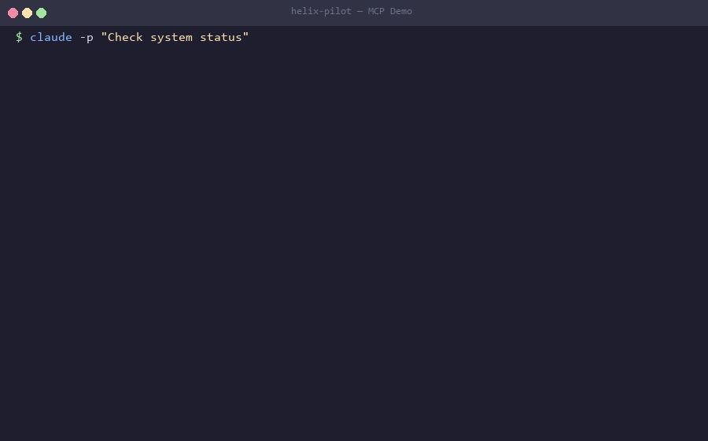
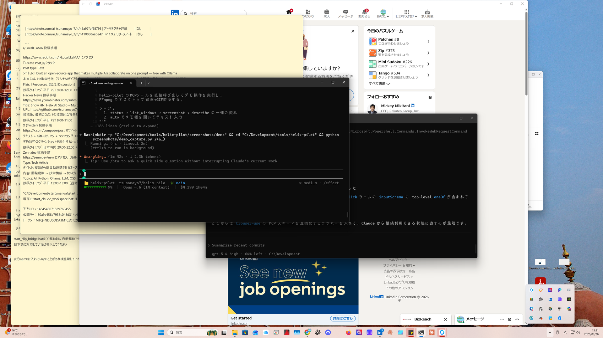

<p align="center">
  <h1 align="center">helix-pilot</h1>
  <p align="center">
    <strong>GUI automation MCP server powered by local Vision LLM (Ollama)</strong>
  </p>
  <p align="center">
    <a href="https://github.com/tsunamayo7/helix-pilot/blob/main/LICENSE"></a>
    <a href="https://www.python.org/"></a>
    <a href="https://modelcontextprotocol.io"></a>
    <a href="https://ollama.com"></a>
    <a href="https://github.com/tsunamayo7/helix-pilot/actions/workflows/ci.yml"></a>
    <a href="https://github.com/tsunamayo7/helix-pilot"></a>
  </p>
</p>

---

helix-pilot lets AI agents **see and control your Windows desktop** through the [Model Context Protocol (MCP)](https://modelcontextprotocol.io). It captures screenshots, analyzes them with a local Ollama Vision model, and executes mouse/keyboard actions — **all running on your machine with zero cloud API cost**.

## Why helix-pilot?

Most GUI automation tools either require expensive cloud APIs, only support macOS, or run inside VMs. **helix-pilot is different:**

- **100% local** — Runs entirely on your machine via Ollama. No cloud API keys, no per-request charges, no data leaving your PC.
- **Windows-native** — Direct host OS control via Win32 API. Not a VM, not a container — real desktop automation.
- **MCP-native** — Built as a first-class MCP server. Works instantly with Claude Code, Codex CLI, Cursor, and any MCP client.
- **Vision LLM powered** — Uses local vision models (Gemma 3, Mistral Small 3.2, etc.) to understand what's on screen, not brittle selectors.
- **Safe by design** — Built-in action policies, secret detection, emergency stop, and user activity monitoring.

### Comparison with alternatives

| Feature | helix-pilot | terminator | UI-TARS Desktop | Peekaboo | Cua |
|---------|:-----------:|:----------:|:---------------:|:--------:|:---:|
| MCP server (CLI-native) | **Yes** | No | Partial | Yes | No |
| Windows host direct control | **Yes** | Yes | Yes | No (macOS) | No (VM) |
| Local Vision LLM (Ollama) | **Yes** | No | No | Yes | No |
| Zero cloud API cost | **Yes** | No | No | **Yes** | No |
| Open WebUI integration | **Yes** | No | No | No | No |
| Built-in safety system | **Yes** | Partial | No | No | Partial |
| Open source (MIT) | **Yes** | Yes | Yes | Yes | Yes |

## Demo

### MCP Tool Calls in Action



AI agent calls helix-pilot tools via MCP: `status()` → `screenshot()` → `describe()` → `auto()`. The Vision LLM analyzes the screen and executes GUI actions autonomously.

### Desktop Screenshot & Vision LLM Analysis



helix-pilot captures the screen and sends it to a local Ollama Vision model for analysis. The model identifies windows, UI elements, and layout — all running locally with zero API cost.

<details>
<summary>Example <code>status()</code> output</summary>

```json
{
  "ok": true,
  "helix_pilot_version": "2.0.0",
  "ollama": { "available": true, "endpoint": "http://localhost:11434" },
  "screen_size": [3840, 2160],
  "agent_runtime": { "tracked_agents": 1, "running_agents": 0 },
  "safe_mode": true,
  "visible_windows": ["Claude Code", "Google Chrome", "Windows PowerShell", "..."]
}
```
</details>

## Quick Start

### Prerequisites

- **Python 3.12+**
- **[uv](https://docs.astral.sh/uv/)** (recommended) or pip
- **[Ollama](https://ollama.com)** with a vision model
- **Windows 10/11**

### 1. Install a Vision Model

```bash
ollama pull mistral-small3.2
```

> Other supported models: `gemma3:27b`, `llava`, `moondream`, or any Ollama vision model.

### 2. Install helix-pilot

```bash
git clone https://github.com/tsunamayo7/helix-pilot.git
cd helix-pilot
uv sync
```

### 3. Configure

Edit `config/helix_pilot.json`:

```json
{
  "ollama_endpoint": "http://localhost:11434",
  "vision_model": "mistral-small3.2:latest"
}
```

### 4. Connect to your MCP client

See [Compatible MCP Clients](#compatible-mcp-clients) below for setup instructions.

## Compatible MCP Clients

helix-pilot works with any MCP-compatible client. Here are tested configurations:

<details>
<summary><strong>Claude Code</strong></summary>

Add to your Claude Code MCP settings (`.claude.json` or project settings):

```json
{
  "mcpServers": {
    "helix-pilot": {
      "command": "uv",
      "args": ["--directory", "/path/to/helix-pilot", "run", "server.py"]
    }
  }
}
```
</details>

<details>
<summary><strong>Codex CLI</strong></summary>

Add to your Codex CLI MCP configuration:

```json
{
  "mcpServers": {
    "helix-pilot": {
      "command": "uv",
      "args": ["--directory", "/path/to/helix-pilot", "run", "server.py"]
    }
  }
}
```
</details>

<details>
<summary><strong>Cursor / Windsurf / VS Code (Copilot)</strong></summary>

Add to your editor's MCP settings:

```json
{
  "mcpServers": {
    "helix-pilot": {
      "command": "uv",
      "args": ["--directory", "/path/to/helix-pilot", "run", "server.py"]
    }
  }
}
```
</details>

<details>
<summary><strong>Open WebUI + Ollama (via MCPO)</strong></summary>

helix-pilot works with [Open WebUI](https://github.com/open-webui/open-webui) and local Ollama models through [MCPO](https://github.com/open-webui/mcpo) (MCP-to-OpenAPI proxy).

1. Install MCPO:

```bash
pip install mcpo
```

2. Create `mcpo_config.json`:

```json
{
  "mcpServers": {
    "helix-pilot": {
      "command": "uv",
      "args": ["--directory", "/path/to/helix-pilot", "run", "server.py"]
    }
  }
}
```

3. Start the proxy:

```bash
mcpo --host 127.0.0.1 --port 8300 --config mcpo_config.json
```

4. In Open WebUI: **Admin Settings > External Tools > Add Server**
   - Type: `OpenAPI`
   - URL: `http://127.0.0.1:8300/helix-pilot`

All 20 tools are now available to any Ollama model with function calling support (e.g. `gemma3:27b`, `qwen3.5:122b`).
</details>

## Available Tools

helix-pilot provides **20 MCP tools** for comprehensive GUI automation:

| Tool | Description |
|------|-------------|
| `screenshot` | Capture screen or window screenshot |
| `click` | Click at screen coordinates |
| `type_text` | Type text (Unicode supported) |
| `hotkey` | Send keyboard shortcut (e.g. `ctrl+c`) |
| `scroll` | Scroll mouse wheel |
| `describe` | Describe screen content via Vision LLM |
| `find` | Find UI element by description, returns coordinates |
| `verify` | Verify screen matches expected state |
| `status` | Check system status (Ollama, models, screen) |
| `list_windows` | List all visible windows |
| `wait_stable` | Wait until screen stops changing |
| `auto` | Autonomous multi-step GUI task execution |
| `browse` | Browser-specialized automation |
| `click_screenshot` | Click then immediately screenshot |
| `resize_image` | Resize image for AI model size limits |
| `spawn_pilot_agent` | Launch a background GUI worker with `default` / `explorer` / `worker` roles |
| `send_pilot_agent_input` | Continue the same GUI worker with a follow-up instruction |
| `wait_pilot_agent` | Wait for the current agent turn and fetch the last result |
| `list_pilot_agents` | Inspect tracked background GUI agents |
| `close_pilot_agent` | Close an idle GUI agent |

## Claude Code-Style Agents

The new lifecycle tools let Claude Code treat helix-pilot as a persistent GUI worker instead of only as one-shot tool calls.

- Use `spawn_pilot_agent` to start a background agent in `auto` or `browse` mode.
- Role presets map naturally to Claude Code delegation:
  `default` for general execution, `explorer` for observation-first `dry_run` planning, `worker` for direct execution.
- Use `send_pilot_agent_input` to continue the same worker with accumulated GUI context.
- Use `wait_pilot_agent`, `list_pilot_agents`, and `close_pilot_agent` to coordinate long-running desktop tasks.

## Safety

helix-pilot includes multiple safety layers to protect your system:

- **Action policies** — configurable per-site allow/deny lists
- **Immutable policy** — blocks secrets (API keys, tokens) from being typed
- **Emergency stop** — move mouse to screen corner to abort
- **User activity detection** — pauses when user is actively using the computer
- **Window deny list** — prevents interaction with sensitive windows (Task Manager, Security, etc.)
- **Execution modes** — `observe_only`, `draft_only`, `apply_with_approval`

## Architecture

```
Claude Code / Codex CLI / Cursor       Open WebUI + Ollama
    |                                       |
    | MCP (stdio)                           | HTTP (via MCPO)
    v                                       v
server.py (FastMCP)  <------------->  MCPO proxy (optional)
    |
    v
HelixPilot (src/pilot.py)
    |
    +-- CoreOperations (PyAutoGUI + Win32 API)
    +-- VisionLLM (Ollama API via httpx)
    +-- SafetyGuard (policies + user monitoring)
    +-- ActionContract (policy evaluation)
```

## Development

```bash
# Run tests
uv run python -m pytest tests/ -v

# Lint
uv run ruff check .

# Syntax check
uv run python -m py_compile server.py

# Run server directly
uv run python server.py
```

## Contributing

Contributions are welcome! Please feel free to submit a Pull Request. For major changes, please open an issue first.

1. Fork the repository
2. Create your feature branch (`git checkout -b feature/amazing-feature`)
3. Commit your changes (`git commit -m 'Add amazing feature'`)
4. Push to the branch (`git push origin feature/amazing-feature`)
5. Open a Pull Request

## Related Projects

- [helix-ai-studio](https://github.com/tsunamayo7/helix-ai-studio) — All-in-one AI chat studio with 7 providers, RAG, MCP tools, and pipeline
- [helix-agent](https://github.com/tsunamayo7/helix-agent) — Extend Claude Code with local Ollama models — cut token costs by 60-80%
- [claude-code-codex-agents](https://github.com/tsunamayo7/claude-code-codex-agents) — MCP bridge to Codex CLI (GPT-5.4) with structured JSONL traces
- [helix-sandbox](https://github.com/tsunamayo7/helix-sandbox) — Secure sandbox MCP server — Docker + Windows Sandbox

## License

[MIT](LICENSE) - feel free to use this in your own projects.

---

<p align="center">
  If you find helix-pilot useful, please consider giving it a star!<br>
  <a href="https://github.com/tsunamayo7/helix-pilot">
    
  </a>
</p>

---

<details>
<summary>Japanese / &#26085;&#26412;&#35486;</summary>

helix-pilot は、ローカルの Vision LLM (Ollama) を使って Windows デスクトップを AI エージェントが操作できる MCP サーバーです。

**特徴:**
- **クラウド API 不要** — Ollama でローカル完結、API 費用ゼロ
- **Windows ネイティブ** — ホスト OS を直接操作（VM ではない）
- **MCP 対応** — Claude Code、Codex CLI、Cursor、VS Code 等ですぐ使える
- **Vision LLM 駆動** — 画面をスクリーンショットし、ローカル Vision モデルで解析・操作
- **安全設計** — アクション制御、シークレット検出、緊急停止、ユーザー操作検知

**クイックスタート:**
```bash
ollama pull mistral-small3.2
git clone https://github.com/tsunamayo7/helix-pilot.git
cd helix-pilot && uv sync
```

MCP クライアント（Claude Code 等）に接続するだけで、20 個の GUI 自動化ツールが利用可能になります。
詳細なセットアップ方法は上記の英語ドキュメントをご覧ください。
</details>
